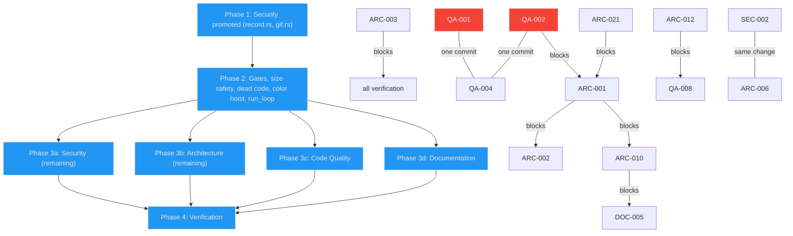

# Project Audit Report

> **Project**: termflix
> **Date**: 2026-09-27
> **Stack**: Rust (edition 2024), crossterm, clap, serde/toml, notify; GitHub Actions; bash installer
> **Audited by**: Claude Code Audit System (Opus 5 subagents, `/opus-audit`)
> **Commit**: `ef5c840`

---

## Executive Summary

termflix is in fair-to-good health: a clean animation abstraction, a careful terminal write path, a small dependency set and a clean `cargo audit`. The most serious finding is that the app crashes in small terminals. Three animations panic at 10x5 cells, a size the resize guard explicitly accepts, and seven more panic when launched in tiny panes. This was reproduced here. The second is that untrusted `.asciianim` files can OOM or crash GIF export (reproduced at 12.6 GB RSS) and inject terminal escape sequences during playback. Top issues remediate in roughly 3–5 focused days: a size guard plus sweep test, recording input validation, gate/CI hardening, and the `run_loop` decomposition. The strongest asset is the `declare_animations!` registry and the mode-agnostic `Canvas` → `CellGrid` → encoder pipeline.

### Issue Count by Severity

Counts are after cross-domain deduplication. Each merged issue is counted once, under the domain whose ID it keeps.

| Severity | Architecture | Security | Code Quality | Documentation | Total |
|----------|:-----------:|:--------:|:------------:|:-------------:|:-----:|
| 🔴 Critical | 0 | 0 | 2 | 0 | **2** |
| 🟠 High     | 6 | 2 | 3 | 6 | **17** |
| 🟡 Medium   | 7 | 2 | 5 | 9 | **23** |
| 🔵 Low      | 8 | 5 | 4 | 7 | **24** |
| **Total**   | **21** | **9** | **14** | **22** | **66** |

### Deduplication Map

These IDs describe the same defect. The surviving ID (left) is the one to fix; the others are satisfied by it.

| Surviving ID | Absorbs | Topic |
|---|---|---|
| ARC-001 | QA-003, QA-019, ARC-008 (construction duplication) | `run_loop` god function, 5× duplicated `create`+`on_resize` |
| ARC-003 | ARC-004, DOC-008 (hook claim) | Pre-commit gate not installed; local vs CI gate drift |
| ARC-005 | DOC-002 | `rust-version` (1.88) and `include` in Cargo.toml |
| ARC-006 | SEC-005 | Release workflow: test gate, pinning, permissions, delete/recreate |
| ARC-010 | DOC-005 (code half) | Keybinding modifiers dropped |
| ARC-012 | QA-005, QA-014 (color/neighbor parts) | `hsv_to_rgb` ×21 and near-duplicate helpers |
| ARC-013 | QA-015 | Silent ndjson/config errors, duplicated external state |
| ARC-014 | DOC-008 (threads/count/pipeline), DOC-009 (threads) | Docs describe the wrong threading model |
| ARC-019 | QA-009 | `scale` honored inconsistently; 25 no-op `#[allow(unused_variables)]` |
| ARC-020 | QA-017 | RNG not injectable/seedable |
| ARC-021 | QA-010 | `#[allow(dead_code)]` hiding dead code |
| ARC-022 | QA-022, DOC-020 (repo root files) | Repo hygiene |
| SEC-001 | QA-011 (gif.rs `as u16` wrap) | Unbounded recording dimensions in GIF export |

---

## User-Directed Focus

No focus areas were supplied. The audit covered all four domains evenly.

---

## 🔴 Critical Issues (Resolve Immediately)

### [QA-001] Three animations panic at the terminal size `run_loop` itself accepts
- **Area**: Code Quality
- **Location**: `src/animations/matrix.rs:40,145-147`, `src/animations/nbody.rs:83`, `src/animations/flappy_bird.rs:69,89`
- **Description**: The rebuild guard at `src/main.rs:821` accepts `cur_cols >= 10 && cur_rows >= 5`. At that floor these animations call `random_range` on an empty range ("cannot sample empty range"). Reproduced in this audit with `--gallery <name> --gallery-cols 10 --gallery-rows 5`: matrix, nbody and flappy_bird each exit 101.
- **Impact**: Resizing a pane small, or auto-cycling into one of these animations in a small tmux split, crashes the app. The panic hook restores the terminal, so the shell survives.
- **Remedy**: Make every size-derived random range non-empty (`lo..hi.max(lo + 1)`) or skip spawning when `hi <= lo`. Land together with QA-002's central guard and QA-004's size sweep.

### [QA-002] No minimum-size guard at startup or animation switch; seven animations panic in tiny terminals
- **Area**: Code Quality
- **Location**: guard missing at `src/main.rs:621` (startup), the transition create near `src/main.rs:885`, the switch create near `src/main.rs:945`. The only guard is at `src/main.rs:821`. Panic sites at 1x1 and 4x2: `aurora.rs:35` (`% (canvas.height/3)` = 0), `cells.rs`, `invaders.rs`, `pong.rs` (`f64::clamp` min > max), `langton.rs:74`, `nbody.rs:83`, `flappy_bird.rs:89`.
- **Impact**: Launching in a tiny pane, or while tmux reports a transient 0x0, crashes immediately.
- **Remedy**: One central policy. Add `MIN_COLS`/`MIN_ROWS` constants and clamp the canvas dimensions in one place used by startup, rebuild and switch (or inside `Canvas::new` so no caller can bypass it). Below the floor, render a "terminal too small" message instead of calling `update`. Then harden individual animations with non-panicking arithmetic as defence in depth.

---

## 🟠 High Priority Issues

### [SEC-001] A crafted `.asciianim` crashes or exhausts memory during `--play --export-gif`
- **Area**: Security (absorbs QA-011's gif.rs cast)
- **Location**: `src/main.rs:1171-1201` (`detect_recording_size`), `src/main.rs:240-243`, `src/gif.rs:44-46`, `src/gif.rs:144-146`, `src/gif.rs:501-503`, `src/gif.rs:675-676`
- **Description**: Export dimensions come from the largest CUP `ESC[r;cH` in frame 1, unbounded. `ESC[70000;70000H` reached 12.6 GB RSS in 4 s. `ESC[4294967296;4294967296H` wraps `cols*rows` to 0 and panics with an out-of-bounds index, leaving a corrupt GIF. `as u16` silently truncates dimensions.
- **Impact**: A shared recording can OOM the host or crash any automation that converts recordings.
- **Remedy**: Clamp detected size (e.g. ≤ 1000×500). In `export_gif`/`export_gif_pixels`, use `u16::try_from` and `checked_mul` with a pixel budget and return `io::ErrorKind::InvalidInput`. Bounds-check the cell index.

### [SEC-002] Installer does not verify the binary and strips macOS quarantine
- **Area**: Security
- **Location**: `install.sh:5,72,109,136-137,140-145`, `.github/workflows/release.yml:265-277`
- **Description**: The binary is installed (often with sudo) with no checksum or signature check. `curl -sL` lacks `-f`, so an HTTP error body can be installed as the executable. `xattr -d com.apple.quarantine` and `xattr -cr` remove Gatekeeper protection. The version tag is scraped with grep/sed and interpolated unvalidated.
- **Impact**: A replaced release asset installs as root on every one-liner run with Gatekeeper suppressed.
- **Remedy**: Publish `SHA256SUMS` from the release job; verify in `install.sh` before `mv`. Use `curl -fsSL`, validate the tag with `^v[0-9]+\.[0-9]+\.[0-9]+$`, drop the `xattr` stripping. Longer term, sign and notarize macOS binaries.

### [ARC-001] `run_loop` is a god function holding all runtime state in locals
- **Area**: Architecture (absorbs QA-003, QA-019, ARC-008)
- **Location**: `src/main.rs:595-1169` (574 lines, 23 params, complexity 107), `src/main.rs:176-475` (`main`, complexity 37). Duplicated `create(...).expect(...); on_resize(...)` at `src/main.rs:633-648`, `832-839`, `884-891`, `944-951`, and `src/gallery.rs:85-94`.
- **Description**: One function owns events, keybindings, transitions, resize/rebuild, external params, recording, pacing, profiling, status bar and writes. Startup constructs the animation twice to learn `preferred_render()`.
- **Impact**: Untestable. Every new setting touches `Cli`, the merge block and the signature. ARC-002 and QA-002 are direct symptoms.
- **Remedy**: `Settings` (resolved once from CLI + config), `LoopState` (mutable runtime), and extracted `handle_key`, `rebuild_canvas`, `step_transition`, `render_frame`, `write_frame`, `status_line`. One `spawn_animation` helper. Make `preferred_render` statically available from the registry.

### [ARC-002] Live dither toggle is lost on every canvas rebuild
- **Area**: Architecture
- **Location**: `src/main.rs:785-787` (toggle), `src/main.rs:831` and `:645` (reset from startup param)
- **Description**: `d` flips `canvas.dither`. Every rebuild (resize, `r`/`c`/`h`, external mode change, transitions with a different preferred render) creates a new `Canvas` and resets `dither` to the startup value.
- **Impact**: Users toggle dither, switch animation, and it silently reverts.
- **Remedy**: Hold `dither` in loop state and apply on every rebuild (subsumed by ARC-001's `LoopState`; can be fixed first with a local `let mut dither`).

### [ARC-003] Pre-commit gate is not installed and nothing else enforces it; local and CI gates differ
- **Area**: Architecture (absorbs ARC-004, DOC-008 hook claim)
- **Location**: `.githooks/pre-commit`, `Makefile:15-27`, `.github/workflows/ci.yml:3-4`, `CLAUDE.md:13,64`
- **Description**: `git config core.hooksPath` resolves to `.git/hooks` and `.git/hooks/pre-commit` does not exist (verified). CI is `workflow_dispatch` only. CI clippy uses `--all-targets --all-features`; `make lint` and the hook do not. `checkall` runs mutating `fmt`, not `fmt-check`.
- **Impact**: Failing commits land on `main` unnoticed and the push-triggered gallery workflow deploys them. "`make checkall` passes" does not prove a fix is clean.
- **Remedy**: `make hooks` target (`git config core.hooksPath .githooks`); `lint` = `cargo clippy --all-targets --all-features -- -D warnings`; `checkall` = `fmt-check lint test build`; hook calls `make checkall`; add `push`/`pull_request` triggers to `ci.yml`; correct CLAUDE.md.

### [ARC-005] Crate package ships agent/internal files and declares no MSRV
- **Area**: Architecture (absorbs DOC-002)
- **Location**: `Cargo.toml`, `README.md:117`, `CLAUDE.md:22`
- **Description**: `cargo package --list` includes `CLAUDE.md`, `AGENTS.md`, `.codex/`, `.gemini/`, `docs/plans/*`, `ideas.md`, `reddit_release.md`, `install.sh`, a 294 KB screenshot. No `rust-version`. Docs claim Rust 1.85, but let-chains (`src/external.rs:138-139,163`, `src/main.rs:263`) require 1.88. No dependency declares a floor above 1.85 (checked via `cargo metadata`).
- **Impact**: Agent config uploaded to crates.io on every publish; users on 1.85–1.87 get opaque compile errors.
- **Remedy**: `rust-version = "1.88"` and an `include` allowlist; README/CLAUDE.md point to Cargo.toml instead of restating a version.

### [ARC-006] Release workflow publishes untested, deletes existing releases, uses mutable refs and broad permissions
- **Area**: Architecture (absorbs SEC-005)
- **Location**: `.github/workflows/release.yml:6-8,23,29,283` and the `github-release` job; `ci.yml:27`; `gallery.yml:46`
- **Description**: No test/clippy job gates `publish-crates`. `gh release delete` then recreate wipes notes/download counts. `dtolnay/rust-toolchain@master`, `Ilshidur/action-discord@master` (gets `DISCORD_WEBHOOK` in a `contents: write` job), `cross` from git HEAD. Workflow-wide `contents: write` and unused `id-token: write`.
- **Impact**: A broken build can be published permanently; an upstream push can swap release binaries or exfiltrate secrets.
- **Remedy**: `needs:` a test job; `gh release create || gh release edit`; pin actions to SHAs; replace the Discord action with `curl`; `cross --locked --tag`; top-level `contents: read`, `contents: write` only on `github-release`, drop `id-token`.

### [QA-004] No behavioral tests for 59 of 60 animations and no size/robustness test
- **Area**: Code Quality
- **Location**: `src/animations/mod.rs:190-287` (registry tests only); `matrix.rs:297` is the only per-animation test
- **Impact**: Every panic in QA-001/QA-002 would have been caught by a trivial loop.
- **Remedy**: Table-driven test over `ANIMATION_NAMES` × render modes × sizes {1x1, 2x2, 10x5, 10x8, 80x24, 300x100}: create, `on_resize`, 30 `update`s; assert no panic and finite pixels in [0,1]; also shrink a live instance.

### [QA-006] Per-cell `String` allocation in the render hot path
- **Area**: Code Quality
- **Location**: `src/render/canvas.rs:435` (`color_to_fg`/`color_to_bg` return `String` via `format!`), called from `src/render/encoder.rs:49,60,66`
- **Impact**: Thousands of heap allocations per frame on truecolor gradients.
- **Remedy**: `fn write_fg(out: &mut String, c)` using `std::fmt::Write`; benchmark with the ignored `bench_dirty` test.

### [QA-007] `gif.rs` duplicates the whole GIF89a writer
- **Area**: Code Quality
- **Location**: `src/gif.rs:494-661` (`export_gif`) and `src/gif.rs:670-797` (`export_gif_pixels`); no-op `let _ = frame_count;` at `gif.rs:655`
- **Remedy**: Extract `GifWriter<W>` (`write_header`, `write_frame`, `finish`); both exporters only convert to palette indices.

### [ARC-012] `hsv_to_rgb` copied into 21 animation files in 4 variants
- **Area**: Architecture (absorbs QA-005, QA-014 color/neighbor parts). Rated High per the Code Quality finding.
- **Location**: 14 identical copies (e.g. `atom.rs:146`, `automata.rs:96`, `boids.rs:268`, `crystallize.rs:212`, `dragon.rs:140`), 4 with `rem_euclid` (`galton.rs:190`, `ink_in_water.rs:177`, `physarum.rs:206`, `strange_attractor.rs:120`), 2 with `((h%1)+1)%1` (`cells.rs:452`, `reaction_diffusion.rs:238`), 1 other (`voronoi.rs:195`). Also `fire_color`/`campfire_color`, `life`/`automata` `count_neighbors`.
- **Impact**: The 14 un-normalized copies map hue ≥ 1.0 to the fallback arm instead of wrapping — a latent color bug.
- **Remedy**: One `pub fn hsv_to_rgb` in a new `src/color.rs` that applies `rem_euclid(1.0)`; diff `voronoi.rs`'s variant first.

### [DOC-001] README install example does not pass `INSTALL_DIR` to the installer
- **Area**: Documentation
- **Location**: `README.md:106`
- **Remedy**: `curl -fsSL …/install.sh | INSTALL_DIR=~/.local/bin bash`.

### [DOC-003] Config path documented as `~/.config/termflix/config.toml` (wrong on macOS/Windows)
- **Area**: Documentation
- **Location**: `src/main.rs:85` (`--init-config` help), `src/config.rs:96`, `CLAUDE.md:40`, `docs/ARCHITECTURE.md:117,501`, `docs/EXTERNAL_ANIMATION.md:372`, `reddit_release.md:28`
- **Description**: `dirs::config_dir()` is `~/Library/Application Support` on macOS and `%APPDATA%` on Windows. Only `README.md:272-275` is right.
- **Remedy**: Help text points at `--show-config`; docs list per-OS paths.

### [DOC-004] Bloom default documented as 0.4, but bloom is off by default
- **Area**: Documentation
- **Location**: `docs/ARCHITECTURE.md:319,533`; code at `src/main.rs:346-356` (bloom 0.0 unless set; 0.4 is the `b` toggle target), `src/main.rs:371-380` (smoothing likewise)
- **Remedy**: Default `0.0 (off)`; explain the `b`/`s` toggle targets.

### [DOC-005] Keybinding docs promise modifier combos the code drops
- **Area**: Documentation (code half is ARC-010)
- **Location**: `CHANGELOG.md:74`, `README.md:329-336`, `src/config.rs:155`
- **Remedy**: After ARC-010 lands, document actions, key names, replace-not-append semantics, fixed keys, and `Ctrl+C`.

### [DOC-006] README lacks docs links, stdin control, and many CLI flags
- **Area**: Documentation
- **Location**: `README.md`
- **Description**: No links to `docs/EXTERNAL_ANIMATION.md`, `docs/ARCHITECTURE.md`, `CHANGELOG.md`. Stdin control never mentioned. `-f/--fps`, `--export-gif`, `--smoothing`, `--list <filter>`, `--gallery-*` flags undocumented. No CLI reference or TOC.
- **Remedy**: CLI reference table from `termflix --help`, Documentation section, stdin example, TOC.

### [DOC-007] Per-animation external-control ranges conflict with the global ranges
- **Area**: Documentation
- **Location**: `docs/EXTERNAL_ANIMATION.md:126-132,345-362`; code `snake.rs:154-155`, `sort.rs:220`, `boids.rs:118`, `particles.rs:75`
- **Description**: `speed: 2.0` slows snake; neutral `intensity: 1.0` pins boids cohesion at max; neutral `color_shift: 0` pins particle drag at 0.9.
- **Remedy**: Per-animation table (field, target, accepted range, direction) and a warning. Whether to remap in code is an enhancement decision.

---

## 🟡 Medium Priority Issues

### Architecture
- **[ARC-007] No single frame pipeline; `clear()` ownership undefined.** `src/main.rs:916-987`, `src/gallery.rs:108-113`, `src/render/encoder.rs` (`bench_dirty`). Gallery skips smoothing/color-assist and clears itself; `run_loop` never clears; 57/60 animations clear in `update`. Remedy: `produce_frame(...)` owning clear → update → smoothing → effects → assist → post; document the contract. (Tracked as ENH-002.)
- **[ARC-009] Three parallel parsers for RenderMode/ColorMode; clap leaks into `render`.** `src/render/canvas.rs:9,20`, `src/config.rs:50-87`, `src/main.rs:1204-1221,275-276`. Remedy: `FromStr` + serde aliases on the enums; delete mirror enums and `parse_*`.
- **[ARC-010] Keybinding system discards modifiers and covers part of the key map.** `src/main.rs:1223-1311`, `:771-787`, `:1046`, `src/record.rs` (`Player::play`). `.map(|(c, _)| vec![c])` drops modifiers; `b`/`s`/`d` hardcoded; status bar labels fixed. Remedy: `(KeyCode, KeyModifiers)` pairs keyed by an `Action` enum; generate status hints from bindings.
- **[ARC-011] `Canvas` exposes all internals as `pub`.** `src/render/canvas.rs:42-65`; in-degree 147. Remedy: `pub(crate)` buffers behind accessors; move `dither`/`color_quant` to a render-options struct.
- **[ARC-013] External-control state stored twice; parse errors silent.** `src/external.rs:13-56,112-170`, `src/config.rs:106` (absorbs QA-015). Remedy: single copy; distinguish `NotFound` from other I/O errors in config load; report rejected ndjson once per distinct error (not while in raw mode — see DOC-011).
- **[ARC-014] Docs describe a different threading model than the code.** `CLAUDE.md:22,25,36`, `docs/ARCHITECTURE.md:38-40`. Writer thread is on by default on Unix; 60 animations, not 55. Text fix owned by Documentation.
- **[ARC-019] Constructors take unused params; `scale` honored by fewer than half the animations.** ~25 files with no-op `#[allow(unused_variables)]` (e.g. `plasma.rs:11`) (absorbs QA-009). Remedy: remove the attributes; document which animations honor `scale`.

### Security
- **[SEC-003] `--play` writes recorded bytes verbatim (terminal escape injection).** `src/record.rs:141-148,191-193`. OSC 52 clipboard writes, OSC 0/2 titles, OSC 8 hyperlinks, report requests. Remedy: allowlist printable text, `\n`, CSI with final byte `H`/`m`/`K`/`J`/`?…h/l`; drop OSC/DCS/APC/PM/SOS and other C0/C1.
- **[SEC-004] Crafted timestamp hangs playback in raw mode.** `src/record.rs:125-128,174-178`. `T 18446744073709551615` sleeps forever; Ctrl-C yields no SIGINT in raw mode. *Established by code reading, not a TTY reproduction.* Remedy: reject non-monotonic or > 24 h timestamps; wait with `event::poll` so `q` works.

### Code Quality
- **[QA-008] Very complex `update`/`draw` methods in game-style animations.** `rainforest.rs:233` (96), `hackerman.rs:170` (62), `maze.rs:265` (60), `flappy_bird.rs:128` (59), `cells.rs:106` (50), `tetris.rs:614` (50), `garden.rs:222` (48), `invaders.rs:90` (48), `pong.rs:76` (38), `tetris.rs:44` (32). Remedy: split `simulate` / `draw`; const rotation table for tetris.
- **[QA-011] Lossy casts on size-derived values.** `aurora.rs:34-35` (`% width` no zero guard), `main.rs:532` (underflow if n=0; guarded today). (gif.rs part absorbed by SEC-001.) Remedy: `checked_sub`/`saturating_sub` on index math.
- **[QA-012] Profiler sort panics on NaN.** `src/main.rs:530`. Remedy: `sort_by(f64::total_cmp)`.
- **[QA-013] 10 `#[allow(clippy::too_many_arguments)]`.** `main.rs:595`, `strange_attractor.rs:109`, `cells.rs:382`, `lightning.rs:58`, `matrix.rs:24`, `sort.rs:6`, `sandstorm.rs:140`, others. Remedy: parameter structs.
- **[QA-014] Near-duplicate particle/spawn scaffolding.** `campfire.rs:16`/`particles.rs:17`/`smoke.rs:18`, `rain.rs:31`/`waterfall.rs:25`, `nbody.rs:46`/`:80`. (Color/neighbor parts absorbed by ARC-012.) Remedy: `spawn_initial_bodies` calls `spawn_body`; leave renderer pair alone.

### Documentation
- **[DOC-008] CLAUDE.md stale** (non-dup parts): pipeline at line 27, CI "manual only" (gallery runs on push), module list missing `gallery.rs`, `png.rs`, `render_sink.rs`, `render/encoder.rs`, `render/cell.rs`, `render/color_assist.rs`; untagged fence at line 26.
- **[DOC-009] ARCHITECTURE.md misses v0.8.0 and `png.rs`** (non-thread parts): `png.rs`, `prev_pixels`, wide-glyph routing (`grid_has_wide`, `encoder.rs:115`) absent.
- **[DOC-010] `matrix` description differs between `--list` and README.** `src/animations/mod.rs:116`, `docs/ARCHITECTURE.md:916`.
- **[DOC-011] EXTERNAL_ANIMATION.md claims errors are always silent.** `docs/EXTERNAL_ANIMATION.md:509,547`; `src/external.rs:151,157` `eprintln!` during raw mode.
- **[DOC-012] Hotkey table incomplete** (`s`, `d`, `Ctrl+C`). `docs/EXTERNAL_ANIMATION.md:493-501`.
- **[DOC-013] README example config forces one render mode on every animation.** `README.md:279-301`.
- **[DOC-014] Contributing section thin and gives wrong commands.** `README.md:355-367`; no CONTRIBUTING.md.
- **[DOC-015] CHANGELOG gaps**: no `[Unreleased]` (commit `1c45147` bumped deps), missing `v0.5.0`/`v0.7.0` tags, no compare links, 0.5.0 render-mode contradictions, 0.4.2 `serde_json` pin claim wrong.
- **[DOC-016] Rustdoc gaps**: 95 of 234 public symbols undocumented; `src/external.rs` has zero `///`; 3 of 77 files have `//!`.

---

## 🔵 Low Priority / Improvements

### Architecture
- **[ARC-015]** Terminal restore duplicated with raw `libc::write` (`src/main.rs:309-326`, `417-456`). Extract `restore_terminal`; consider an RAII guard.
- **[ARC-016]** `--record` toggles raw mode inside the event handler (`src/main.rs:725-733`). Save after restore instead.
- **[ARC-017]** Legacy string render path kept alive for tests (`canvas.rs:141-147,187`, `braille.rs:26`, `halfblock.rs:10`).
- **[ARC-018]** Recording/GIF export re-parse ANSI via a hand-written VT (`src/gif.rs:32-200`). (Tracked as ENH-003.)
- **[ARC-020]** RNG not injectable (43 animations use `rand::rng()` directly) (absorbs QA-017). (Tracked as ENH-001.)
- **[ARC-021]** `#[allow(dead_code)]` hiding dead code (absorbs QA-010): `canvas.rs:114`, `generators/mod.rs:146,241,247`, `record.rs:76` (stale allow — it is used), `tetris.rs:100,125,237`, `crystallize.rs:53`, `automata.rs:7,9`, `reaction_diffusion.rs:10,12`, `animations/mod.rs:87`.
- **[ARC-022]** Repo hygiene (absorbs QA-022, DOC-020 root files): `.gitignore` lists tracked `.githooks/` and `ideas.md`; stray `ideas.md~`, `.gitignore~`; `pub mod generators` in a binary crate (`src/main.rs:5`).
- **[ARC-023]** `detect_recording_size` inspects only frame 1 (`src/main.rs:1171`). Store dims in the header.

### Security
- **[SEC-006]** ndjson example path is world-writable `/tmp/termflix.json` (`src/config.rs:153`); unbounded `read_to_string` and `stdin.lines()` (`src/external.rs:120,137,162`).
- **[SEC-007]** Parse errors echo attacker content to stderr (`src/record.rs:100-101`). Use `escape_debug()`.
- **[SEC-008]** Record/playback memory unbounded; `FRAMES` header ignored (`src/record.rs:30-35,108,113-149`).
- **[SEC-009]** `unsafe` `libc::write`/`tcflush` lack `// SAFETY:` comments (`src/main.rs:316-318,424-426,440-442`). Sound.
- **[SEC-010]** `--gallery-cols/-rows` unbounded (`src/main.rs:223-227`). Use clap `range(1..=1000)`.

### Code Quality
- **[QA-016]** Per-frame bloom scratch allocation (`canvas.rs:268`), clone on size mismatch (`canvas.rs:202`).
- **[QA-018]** `expect` in `--init-config` (`src/main.rs:181`) should be a friendly `io::Error`.
- **[QA-020]** `fn name(&self) -> &str` should be `&'static str` (60 pedantic warnings).
- **[QA-021]** `main.rs:1249` `unwrap` after byte-length guard; multibyte keys never match.
- **[QA-009, QA-010, QA-017, QA-022]** absorbed — see Deduplication Map.

### Documentation
- **[DOC-017]** Mermaid uses 90 per-node `style` lines, not `classDef`.
- **[DOC-018]** Untagged fences (`docs/ARCHITECTURE.md:114,268,425,447,629`) and emoji callouts (15).
- **[DOC-019]** Inconsistent `src/` prefixes in ARCHITECTURE.md (`:142,176,264,276,323,461`).
- **[DOC-020]** Stale planning docs lack status markers (`docs/plans/*`, `docs/superpowers/*`); `ideas.md:80,103` docs item is obsolete; `reddit_release.md` is a v0.5.1 snapshot. (Root backup files absorbed by ARC-022.)
- **[DOC-021]** No troubleshooting section.
- **[DOC-022]** `AGENTS.md` is a bare `@CLAUDE.md` import.
- **[DOC-023]** No CI badge; tmux FPS figures undated.

---

## Detailed Findings

### Architecture & Design
Overall health **Good**. Key concern: all runtime state and control flow lives in a 23-parameter `run_loop` of complexity 107, which already causes lost state (ARC-002), and the gate meant to guard it is not installed nor enforced in CI (ARC-003). Parsight's dead-code list flags every animation `new` as unreachable; those are false positives through the `declare_animations!` macro. Findings ARC-001 through ARC-023 above. Top hubs by parsight: `Canvas` (in-degree 147), `Animation` trait (121, articulation point), `run_loop` (out-degree 104, articulation point).

### Security Assessment
Overall posture **Fair**. No secrets in tree or history; `cargo audit` clean across 109 crates; no `Command::new` outside the tmux restore; `unsafe` confined to libc I/O on the process's own stdout. External-control values are clamped and names allowlisted. The attack surface is untrusted files the user opens (`.asciianim`, ndjson) and the release/install supply chain. SEC-001 was reproduced (12.6 GB RSS; exit 101 OOB panic). SEC-004 was established by code reading only.

### Code Quality
Overall health **Fair**. `cargo test`: 101 passed, 2 ignored. 0 TODO/FIXME. 48 `#[allow]` sites (25 `unused_variables`, 13 `dead_code`, 10 clippy). Estimated coverage < 30%: codecs (LZW with reference decoder, PNG CRC), render snapshots and smoothing math are covered; 59 animations, `run_loop`, gallery, keybinding parsing and `detect_recording_size` are not. Churn hotspots were unavailable at audit time (`no_temporal_episodes`); history backfill was started afterward.

### Documentation Review
Overall health **Good**. The README animation table matches the registry exactly (all 60, default render modes correct); every README config key matches `src/config.rs`; `docs/EXTERNAL_ANIMATION.md` is an excellent protocol reference. Drift concentrates in facts users rely on: config path on macOS/Windows, MSRV, the `INSTALL_DIR` example, keybinding modifiers, bloom default. Rustdoc: 139/234 public symbols documented.

---

## Remediation Roadmap

### Immediate Actions (Before Next Release)
1. QA-001 + QA-002 + QA-004 — size floor, panic-free ranges, size-sweep test.
2. SEC-001 — bound recording dimensions in GIF export.
3. ARC-003 — install the hook, align `make lint` with CI, trigger CI on push.
4. ARC-005 + ARC-006 + SEC-002 — MSRV/include, gated/pinned release, checksummed installer.

### Short-term (Next 1–2 Sprints)
1. SEC-003, SEC-004, SEC-007, SEC-008 — harden `.asciianim` playback as one batch.
2. ARC-021 (dead code) then ARC-001 + ARC-002 (`run_loop` decomposition).
3. ARC-012 — hoist `hsv_to_rgb` before other per-animation edits.
4. QA-006, QA-007 — render hot-path allocation and GIF writer dedupe.
5. DOC-001, DOC-003, DOC-004, DOC-006, DOC-007 — user-facing doc facts.

### Long-term (Backlog)
1. ARC-009, ARC-010, ARC-011, ARC-013 — enum parsing, keybinding actions, Canvas encapsulation, external state.
2. QA-008, QA-013, QA-014 — complexity and duplication reduction in game animations.
3. Enhancements ENH-001..ENH-005 (kanban cards, plans in `docs/opus/`).

---

## Positive Highlights

1. `declare_animations!` is a single registration point generating `ANIMATIONS`, `ANIMATION_NAMES` and `create()`, with sync tests (`src/animations/mod.rs:93-206`).
2. Simulation is decoupled from display: animations write a mode-agnostic sub-cell `Canvas`; `CellGrid` + encoder handle terminal bytes, with dirty-cell diffing and a full-redraw threshold.
3. The write path is carefully engineered: shared `write_chunked` for inline and threaded modes, bounded capacity-1 channel for backpressure, quit checks between chunks, timed shutdown join (`src/render_sink.rs`).
4. Terminal lifecycle is robust: panic hook restores the terminal, the BSU block is closed on exit, `tcflush`, tmux clear-history.
5. Codec tests are strong: LZW verified against an in-test reference decoder including dictionary-full, PNG chunks CRC-verified.
6. `Canvas::set*` is bounds-checked, so no animation can index out of the buffer through the API; every panic found came from RNG ranges and clamps.
7. External control is clamped at two levels and names are allowlisted; no shell-outs beyond the fixed tmux commands.
8. Small, current dependency set with in-house GIF/PNG/base64; `cargo audit` clean.

---

## Audit Confidence

| Area | Files Reviewed | Confidence |
|------|---------------|-----------|
| Architecture | ~25 (graph-wide via parsight) | High |
| Security | ~15 + reproductions | High |
| Code Quality | ~70 (graph-wide + gallery size sweep) | High |
| Documentation | 16 docs + rustdoc sample | High |

*Churn history was backfilled after the agents ran (`replay_history`, 365 days). Hotspots (churn × complexity): `run_loop` 5029 (47 changes × 107), `main` 1073, `Garden::update` 384, `Hackerman::update` 248, `Cells::update` 200, `Maze::draw` 180 — confirming ARC-001 as the top refactor target and QA-008's ordering.*

---

## Remediation Plan

> This section is generated by the audit and consumed directly by `/fix-audit`.
> It pre-computes phase assignments and file conflicts so the fix orchestrator
> can proceed without re-analyzing the codebase.
>
> **Deviation from the default table (explicit):** there are no Critical Security or Critical
> Architecture issues. Phase 1 holds Security issues promoted for conflict files. Phase 2 holds
> the gate fix (ARC-003, which blocks every domain's verification) and a *pre-refactor* batch
> — QA-004, QA-001, QA-002, ARC-021 — pulled ahead of ARC-001 because QA-002's size guard must
> exist before the `run_loop` refactor so the refactor preserves it, and rule R1 requires dead
> code removal before a structural refactor. ARC-012 is also in Phase 2 because it blocks
> per-animation edits in ~21 files.

### Phase Assignments

#### Phase 1 — Critical Security (Sequential, Blocking)
<!-- No Critical Security issues. All rows are promoted: they modify conflict files also targeted by Code Quality/Architecture. -->
| ID | Title | File(s) | Severity |
|----|-------|---------|----------|
| SEC-001 | Unbounded recording dimensions in GIF export | `src/main.rs`, `src/gif.rs` | High (promoted) |
| SEC-003 | Terminal escape injection in `--play` | `src/record.rs` | Medium (promoted) |
| SEC-004 | Crafted timestamp hangs playback | `src/record.rs` | Medium (promoted) |
| SEC-007 | Parse errors echo file content | `src/record.rs` | Low (promoted) |
| SEC-008 | Unbounded record/playback memory | `src/record.rs` | Low (promoted) |

#### Phase 2 — Critical Architecture (Sequential, Blocking)
<!-- Run in this order. -->
| ID | Title | File(s) | Severity | Blocks |
|----|-------|---------|----------|--------|
| ARC-003 | Gate not installed; local/CI gate drift | `Makefile`, `.githooks/pre-commit`, `.github/workflows/ci.yml`, `CLAUDE.md` | High | all verification |
| QA-004 | Animation size-sweep test | `src/animations/mod.rs` | High | QA-001, QA-002 (regression check) |
| QA-001 | Panics at 10x5 in matrix/nbody/flappy_bird | `src/animations/matrix.rs`, `nbody.rs`, `flappy_bird.rs` | Critical | — |
| QA-002 | Central minimum-size guard | `src/main.rs`, `src/render/canvas.rs`, `aurora.rs`, `cells.rs`, `invaders.rs`, `pong.rs`, `langton.rs` | Critical | ARC-001 |
| ARC-021 | Remove dead code behind `#[allow(dead_code)]` | `canvas.rs`, `generators/mod.rs`, `record.rs`, `tetris.rs`, `crystallize.rs`, `automata.rs`, `reaction_diffusion.rs`, `animations/mod.rs` | Low (promoted) | ARC-001 |
| ARC-012 | Hoist `hsv_to_rgb` to `src/color.rs` | `src/color.rs` (new), `src/main.rs`, 21 animation files | High | QA-008, QA-013, QA-014, ARC-019 |
| ARC-001 | Decompose `run_loop`/`main`; single spawn helper | `src/main.rs`, `src/gallery.rs`, `src/animations/mod.rs` | High | ARC-002, ARC-009, ARC-010, ARC-015, ARC-016, QA-011, QA-012, QA-018, QA-021, SEC-010 |
| ARC-002 | Persist dither across rebuilds | `src/main.rs` | High | — |

#### Phase 3 — Parallel Execution
<!-- All remaining work, safe to run concurrently by domain. Files shared across domains are in the conflict map. -->

**3a — Security (remaining)**
| ID | Title | File(s) | Severity |
|----|-------|---------|----------|
| SEC-002 | Checksummed installer; stop stripping quarantine | `install.sh`, `.github/workflows/release.yml` | High |
| SEC-006 | ndjson path and read bounds | `src/external.rs`, `src/config.rs` | Low |
| SEC-009 | `// SAFETY:` comments on unsafe | `src/main.rs` | Low |
| SEC-010 | Bound gallery dimensions | `src/main.rs` | Low |

**3b — Architecture (remaining)**
| ID | Title | File(s) | Severity |
|----|-------|---------|----------|
| ARC-005 | `rust-version = "1.88"` and `include` | `Cargo.toml` | High |
| ARC-006 | Release workflow gate/pin/permissions | `.github/workflows/release.yml`, `ci.yml`, `gallery.yml` | High |
| ARC-009 | Single parser for render/color modes | `src/render/canvas.rs`, `src/config.rs`, `src/main.rs` | Medium |
| ARC-010 | Keybinding actions with modifiers | `src/main.rs`, `src/config.rs`, `src/record.rs` | Medium |
| ARC-011 | Encapsulate `Canvas` fields | `src/render/canvas.rs`, `src/gallery.rs`, 3 animations | Medium |
| ARC-013 | External state single-copy; error visibility | `src/external.rs`, `src/config.rs` | Medium |
| ARC-019 | Remove no-op allows; document `scale` | ~25 animation files, `README.md` | Medium |
| ARC-015 | Shared `restore_terminal` | `src/main.rs` | Low |
| ARC-016 | Save recording after restore | `src/main.rs` | Low |
| ARC-017 | Collapse legacy render path | `src/render/canvas.rs`, `braille.rs`, `halfblock.rs` | Low |
| ARC-022 | Repo hygiene | `.gitignore`, `src/main.rs` | Low |
| ARC-023 | Recording header carries dimensions | `src/record.rs`, `src/main.rs` | Low |

**3c — Code Quality (remaining)**
| ID | Title | File(s) | Severity |
|----|-------|---------|----------|
| QA-006 | Allocation-free color escape writing | `src/render/canvas.rs`, `src/render/encoder.rs` | High |
| QA-007 | Shared `GifWriter` | `src/gif.rs` | High |
| QA-008 | Split complex game `update`/`draw` | `rainforest.rs`, `hackerman.rs`, `maze.rs`, `flappy_bird.rs`, `cells.rs`, `tetris.rs`, `garden.rs`, `invaders.rs`, `pong.rs` | Medium |
| QA-011 | Checked index/size arithmetic | `aurora.rs`, `src/main.rs` | Medium |
| QA-012 | NaN-safe profiler sort | `src/main.rs` | Medium |
| QA-013 | Parameter structs for too-many-args | `strange_attractor.rs`, `cells.rs`, `lightning.rs`, `matrix.rs`, `sort.rs`, `sandstorm.rs` | Medium |
| QA-014 | Shared spawn scaffolding | `nbody.rs`, `campfire.rs`, `particles.rs`, `smoke.rs`, `rain.rs`, `waterfall.rs` | Medium |
| QA-016 | Bloom scratch buffer | `src/render/canvas.rs` | Low |
| QA-018 | Friendly `--init-config` error | `src/main.rs` | Low |
| QA-020 | `name()` returns `&'static str` | `src/animations/mod.rs`, 60 animations | Low |
| QA-021 | Keybinding single-char parse | `src/main.rs` | Low |

**3d — Documentation (all)**
| ID | Title | File(s) | Severity |
|----|-------|---------|----------|
| DOC-001 | Fix `INSTALL_DIR` example | `README.md` | High |
| DOC-003 | Per-OS config path | `src/main.rs`, `src/config.rs`, `CLAUDE.md`, `docs/ARCHITECTURE.md`, `docs/EXTERNAL_ANIMATION.md`, `reddit_release.md` | High |
| DOC-004 | Bloom/smoothing defaults | `docs/ARCHITECTURE.md` | High |
| DOC-005 | Keybinding reference | `README.md`, `CHANGELOG.md`, `src/config.rs` | High |
| DOC-006 | README CLI reference, docs links, stdin, TOC | `README.md` | High |
| DOC-007 | Per-animation external ranges table | `docs/EXTERNAL_ANIMATION.md` | High |
| ARC-014 | Thread model and animation count | `CLAUDE.md`, `docs/ARCHITECTURE.md` | Medium |
| DOC-008 | CLAUDE.md pipeline/CI/module list | `CLAUDE.md` | Medium |
| DOC-009 | ARCHITECTURE.md v0.8.0, png.rs, prev_pixels | `docs/ARCHITECTURE.md` | Medium |
| DOC-010 | matrix description | `src/animations/mod.rs`, `docs/ARCHITECTURE.md` | Medium |
| DOC-011 | Watcher error behavior | `docs/EXTERNAL_ANIMATION.md` | Medium |
| DOC-012 | Hotkey table | `docs/EXTERNAL_ANIMATION.md` | Medium |
| DOC-013 | README example config | `README.md` | Medium |
| DOC-014 | CONTRIBUTING.md | `CONTRIBUTING.md` (new), `README.md` | Medium |
| DOC-015 | CHANGELOG `[Unreleased]` and fixes | `CHANGELOG.md` | Medium |
| DOC-016 | Rustdoc on public items | `src/external.rs`, `src/gallery.rs`, `src/render/*`, `src/render_sink.rs`, `src/gif.rs`, `src/config.rs` | Medium |
| DOC-017 | Mermaid `classDef` | `docs/ARCHITECTURE.md`, `docs/EXTERNAL_ANIMATION.md` | Low |
| DOC-018 | Fence tags, callouts | `docs/ARCHITECTURE.md`, `docs/EXTERNAL_ANIMATION.md`, `CLAUDE.md` | Low |
| DOC-019 | `src/` prefixes | `docs/ARCHITECTURE.md` | Low |
| DOC-020 | Status markers on plans; ideas.md | `docs/plans/*`, `docs/superpowers/*`, `ideas.md`, `reddit_release.md` | Low |
| DOC-021 | Troubleshooting section | `README.md` | Low |
| DOC-022 | AGENTS.md pointer | `AGENTS.md` | Low |
| DOC-023 | CI badge, dated FPS figures | `README.md` | Low |

### File Conflict Map
<!-- Files touched by issues in multiple domains. Fix agents must read current file state before editing. -->

| File | Domains | Issues | Risk |
|------|---------|--------|------|
| `src/main.rs` | Security + Architecture + Code Quality + Documentation | SEC-001, SEC-009, SEC-010, ARC-001, ARC-002, ARC-009, ARC-010, ARC-015, ARC-016, ARC-022, ARC-023, QA-002, QA-011, QA-012, QA-018, QA-021, DOC-003 | ⚠️ Read before edit — highest contention |
| `src/gif.rs` | Security + Code Quality + Documentation | SEC-001, QA-007, DOC-016 | ⚠️ Read before edit |
| `src/record.rs` | Security + Architecture | SEC-003, SEC-004, SEC-007, SEC-008, ARC-010, ARC-021, ARC-023 | ⚠️ Read before edit |
| `src/render/canvas.rs` | Architecture + Code Quality + Documentation | ARC-009, ARC-011, ARC-017, ARC-021, QA-002, QA-006, QA-016, DOC-016 | ⚠️ Read before edit |
| `src/config.rs` | Security + Architecture + Documentation | SEC-006, ARC-009, ARC-010, ARC-013, DOC-003, DOC-005, DOC-016 | ⚠️ Read before edit |
| `src/external.rs` | Security + Architecture + Documentation | SEC-006, ARC-013, DOC-016 | ⚠️ Read before edit |
| `.github/workflows/release.yml` | Security + Architecture | SEC-002, ARC-006 | ⚠️ One combined change |
| `Cargo.toml` | Architecture + Documentation | ARC-005 (absorbs DOC-002) | ⚠️ Read before edit |
| `CLAUDE.md` | Architecture + Documentation | ARC-003, ARC-014, DOC-003, DOC-008, DOC-018 | ⚠️ Read before edit |
| `README.md` | Architecture + Documentation | ARC-019, DOC-001, DOC-005, DOC-006, DOC-013, DOC-014, DOC-021, DOC-023 | ⚠️ Read before edit |
| `src/animations/mod.rs` | Architecture + Code Quality + Documentation | ARC-001, ARC-021, QA-004, QA-020, DOC-010 | ⚠️ Read before edit |
| `src/generators/mod.rs` | Architecture | ARC-021 | Low |
| `src/gallery.rs` | Architecture + Documentation | ARC-001, ARC-011, DOC-016 | ⚠️ Read before edit |
| ~21 `src/animations/*.rs` with `hsv_to_rgb` | Architecture + Code Quality | ARC-012, ARC-019, QA-008, QA-013, QA-014 | ⚠️ ARC-012 first |
| `src/animations/{matrix,nbody,flappy_bird,cells}.rs` | Code Quality (multiple phases) | QA-001/QA-002 (Phase 2) then QA-008/QA-013/QA-014 (3c) | ⚠️ Read before edit |

### Blocking Relationships
- ARC-003 → every other issue: verification is not meaningful until `make checkall` matches CI (`--all-targets` clippy, `fmt-check`).
- QA-004 + QA-001 + QA-002 land as **one commit**: the size sweep is their regression test and fails on `main` until both fixes exist. Write the test first, but never commit it failing (the ARC-003 hook would reject it). On the board QA-004 depends on QA-001 and QA-002; all three depend on ARC-003.
- QA-002 → ARC-001: the size guard must exist before `run_loop` is decomposed so `rebuild_canvas` preserves it in one place.
- ARC-021 → ARC-001: rule R1 — remove dead code in a separate commit before the structural refactor.
- ARC-001 → ARC-002, ARC-009, ARC-010, ARC-015, ARC-016, QA-011, QA-012, QA-018, QA-021, SEC-009, SEC-010: all edit `main()`/`run_loop`, which ARC-001 rewrites.
- ARC-012 → QA-008, QA-013, QA-014, ARC-019: per-animation edits must not conflict with the deletion of local `hsv_to_rgb` copies.
- SEC-001 → ARC-023, QA-007: SEC-001 changes `detect_recording_size` and `export_gif`; later moves/splits build on it.
- SEC-003/004/007/008 → ARC-010, ARC-021, ARC-023 (record.rs): security batch on `Player::load`/`play` lands first.
- SEC-002 + ARC-006: both edit `release.yml` — do as one change.
- ARC-010 → DOC-005: docs describe the fixed keybinding behavior.
- ARC-013 → DOC-011: docs describe the final watcher error path.
- ARC-001, ARC-014 → DOC-008, DOC-009: write architecture docs once against the final structure.
- ARC-005 → DOC-002 (absorbed): MSRV confirmed at 1.88 (let-chains; no dependency declares > 1.85).

### Dependency Diagram

