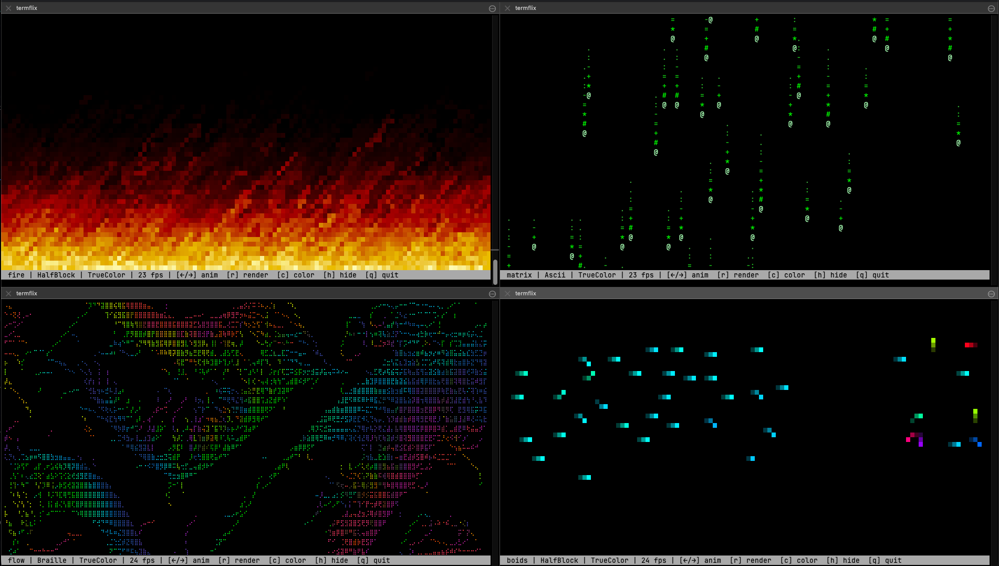

# termflix

[](https://crates.io/crates/termflix)


A terminal animation player with 43 procedurally generated animations, multiple render modes, and true color support. Low CPU impact, works great in tmux, zero dependencies beyond your terminal.

[](https://buymeacoffee.com/probello3)



## Features

- **43 Animations** — Fire, matrix rain, starfields, plasma, ocean waves, aurora, lightning, and much more
- **3 Render Modes** — Braille (highest resolution), half-block, and ASCII density mapping
- **4 Color Modes** — Mono, ANSI 16, ANSI 256, and 24-bit true color
- **Per-Animation Defaults** — Each animation auto-selects its best render mode
- **Runtime Hotkeys** — Cycle animations, render modes, and color modes on the fly
- **Recording & Playback** — Record sessions and replay them
- **Auto-Cycle** — Rotate through animations on a timer
- **Particle System** — Reusable procedural particle engine powering many animations
- **Low CPU** — Efficient rendering with minimal resource usage

## Animations

| Animation | Description | Default Render |
|-----------|-------------|---------------|
| `fire` | Classic rising flames with heat simulation | Half-block |
| `matrix` | Digital rain with glowing lead characters | ASCII |
| `plasma` | Colorful sine-wave plasma interference | Half-block |
| `starfield` | 3D starfield flying through space | Braille |
| `wave` | Sine wave interference patterns | Half-block |
| `life` | Conway's Game of Life cellular automaton | Half-block |
| `particles` | Particle fountain with gravity | Half-block |
| `rain` | Falling rain with splash effects | Half-block |
| `fountain` | Water fountain with spray | Half-block |
| `flow` | Fluid flow field visualization | Half-block |
| `spiral` | Colorful rotating spiral arms | Half-block |
| `ocean` | Ocean waves with foam | Half-block |
| `aurora` | Northern lights / aurora borealis | Half-block |
| `lightning` | Lightning bolts with recursive branching | Half-block |
| `smoke` | Smoke rising with turbulence | Half-block |
| `ripple` | Ripple interference from random drops | Half-block |
| `snow` | Snowfall with ground accumulation | Half-block |
| `fireflies` | Fireflies blinking with warm glow | Half-block |
| `dna` | DNA double helix rotation | Half-block |
| `pulse` | Pulsing concentric rings | Half-block |
| `boids` | Flocking simulation (boids algorithm) | Half-block |
| `lava` | Lava lamp with rising/falling blobs | Half-block |
| `sandstorm` | Blowing sand with dune formation | Half-block |
| `petals` | Cherry blossom petals drifting in wind | Half-block |
| `campfire` | Campfire with logs, flames, and embers | Half-block |
| `waterfall` | Cascading water with mist spray | Half-block |
| `eclipse` | Solar eclipse with corona | Half-block |
| `blackhole` | Black hole with accretion disk | Half-block |
| `radar` | Radar sweep with blips | Half-block |
| `crystallize` | Crystal growth via diffusion-limited aggregation | Braille |
| `hackerman` | Fake hacker terminal with scrolling commands | ASCII |
| `visualizer` | Audio-style frequency visualizer | Half-block |
| `cells` | Petri dish — cells with membranes and organelles | Half-block |
| `atom` | Atomic model with orbiting electrons | Half-block |
| `globe` | Rotating wireframe globe | Half-block |
| `dragon` | Dragon curve fractal | Braille |
| `sierpinski` | Sierpinski triangle fractal | Braille |
| `mandelbrot` | Animated Mandelbrot set zoom | Braille |
| `langton` | Langton's ant cellular automaton | Half-block |
| `sort` | Sorting algorithm visualization | Half-block |
| `snake` | Snake game (AI-controlled) | Half-block |
| `invaders` | Space invaders demo | Half-block |
| `pong` | Pong game (AI vs AI) | Half-block |

## Installation

### Quick Install (Linux / macOS / WSL)

```bash
curl -sL https://raw.githubusercontent.com/paulrobello/termflix/main/install.sh | bash
```

Installs the latest release binary to `/usr/local/bin`. Custom install location:

```bash
INSTALL_DIR=~/.local/bin curl -sL https://raw.githubusercontent.com/paulrobello/termflix/main/install.sh | bash
```

### From crates.io

```bash
cargo install termflix
```

### From Source

Requires Rust 1.85+ (edition 2024):

```bash
git clone https://github.com/paulrobello/termflix
cd termflix
make install
```

### Pre-built Binaries

Download from [GitHub Releases](https://github.com/paulrobello/termflix/releases/latest):

| Platform | Binary |
|----------|--------|
| Linux x86_64 | `termflix-linux-x86_64` |
| Linux ARM64 | `termflix-linux-aarch64` |
| macOS x86_64 | `termflix-macos-x86_64` |
| macOS ARM64 (Apple Silicon) | `termflix-macos-aarch64` |
| Windows x86_64 | `termflix-windows-x86_64.exe` |

**macOS note:** After downloading manually, remove the quarantine flag:
```bash
xattr -cr termflix-macos-*
chmod +x termflix-macos-*
```

## Usage

```bash
# Run default animation (fire)
termflix

# Run a specific animation
termflix -a starfield

# List all animations
termflix --list

# Set render mode (braille, half-block, ascii)
termflix -a plasma -r braille

# Set color mode (mono, ansi16, ansi256, true-color)
termflix -a fire -c true-color

# Auto-cycle through animations every 10 seconds
termflix --cycle 10

# Scale particle density
termflix -a rain --scale 1.5

# Clean mode (no status bar)
termflix --clean

# Record a session
termflix -a matrix --record session.termflix

# Play back a recording
termflix --play session.termflix
```

## Hotkeys

| Key | Action |
|-----|--------|
| `q` / `Esc` | Quit |
| `←` / `→` | Previous / next animation |
| `r` | Cycle render mode (braille → half-block → ascii) |
| `c` | Cycle color mode |
| `h` | Toggle status bar |

## How It Works

termflix uses a pixel-level canvas that gets rendered to terminal characters:

- **Braille mode** (`⠁⠂⠃...⣿`) — 2×4 pixels per terminal cell = highest resolution
- **Half-block mode** (`▀▄█`) — 1×2 pixels per cell = good balance of resolution and color
- **ASCII mode** (` .:-=+*#%@`) — 1×1 pixel per cell = widest compatibility

Each animation implements the `Animation` trait, writing to the canvas at sub-cell resolution. The renderer converts the canvas to terminal escape sequences with cursor positioning (no newlines — eliminates flickering).

A reusable `ParticleSystem` generator powers many of the particle-based animations with configurable emitters, gradients, gravity, and drag.

## tmux Support

termflix auto-detects tmux and adapts:

- **Adaptive frame pacing** — Automatically adjusts frame rate to match tmux's throughput, preventing output backlog and input lag
- **Responsive quit** — Runs `tmux clear-history` on exit to flush buffered output
- **Split-safe** — No lockups when splitting panes; FPS scales with pane size
- **Background-safe** — No output backlog when switching away from iTerm2

Typical FPS in tmux (200×44, halfblock truecolor):
- Full pane: ~10 fps (smooth)
- Split pane: ~20 fps (less output per frame)
- Outside tmux: 24 fps (full speed)

## Configuration

termflix auto-detects your terminal size and adapts. All settings can be overridden via CLI flags.

## Contributing

Contributions are welcome! To add a new animation:

1. Create `src/animations/your_animation.rs` implementing the `Animation` trait
2. Register it in `src/animations/mod.rs`
3. Run `cargo build --release` and test

```bash
cargo fmt       # Format code
cargo clippy    # Lint
cargo build     # Build
```

## License

This project is licensed under the MIT License — see the [LICENSE](LICENSE) file for details.

## Author

Paul Robello — probello@gmail.com

## Links

- **GitHub**: [https://github.com/paulrobello/termflix](https://github.com/paulrobello/termflix)
- **Crates.io**: [https://crates.io/crates/termflix](https://crates.io/crates/termflix)
