# termflix Architecture

Comprehensive technical architecture reference for termflix — a single-binary Rust TUI application that renders procedurally generated animations in the terminal using Unicode characters, with support for multiple render modes, color modes, external scripted control, and recording/playback.

## Table of Contents

- [Overview](#overview)
- [Module Structure](#module-structure)
- [The Animation Trait](#the-animation-trait)
- [Canvas and Pixel Space](#canvas-and-pixel-space)
- [Render Pipeline](#render-pipeline)
  - [Render Modes](#render-modes)
  - [Color Modes](#color-modes)
  - [Post-Process Effects](#post-process-effects)
- [Frame Loop](#frame-loop)
  - [Frame Timing and Adaptive Pacing](#frame-timing-and-adaptive-pacing)
  - [Synchronized Output](#synchronized-output)
  - [Resize Handling](#resize-handling)
- [Configuration System](#configuration-system)
- [External Control Subsystem](#external-control-subsystem)
- [Recording Subsystem](#recording-subsystem)
- [Generators (Shared Utilities)](#generators-shared-utilities)
- [Animation Catalog](#animation-catalog)
- [Terminal Exit Sequence](#terminal-exit-sequence)
- [Key Design Decisions](#key-design-decisions)
- [Related Documentation](#related-documentation)

---

## Overview

termflix renders 43 procedurally generated animations directly in the terminal using Unicode sub-cell characters. All animation logic writes to a mode-agnostic pixel buffer; the renderer translates that buffer into ANSI escape sequences appropriate for the configured render and color modes. The result is a clean separation between simulation and display that allows both to evolve independently.

The binary is fully synchronous — one main thread drives the event loop, a single optional background thread reads external control parameters, and `crossterm` handles terminal I/O.

---

## Module Structure

The following diagram shows the dependency graph between the top-level modules. Arrows represent `use` or `mod` relationships, with direction indicating the dependency direction (dependant → dependency).

```mermaid
graph TD
    main["main.rs\nCLI · startup · run_loop"]
    config["config.rs\nConfig · TOML loading"]
    external["external.rs\nExternalParams · CurrentState · spawn_reader"]
    record["record.rs\nRecorder · Player · .asciianim"]
    generators["generators/mod.rs\nParticle · ParticleSystem\nColorGradient · EmitterConfig"]
    anim_mod["animations/mod.rs\nAnimation trait · create() factory\nANIMATION_NAMES · ANIMATIONS"]
    anim_impls["animations/*.rs\n43 animation modules"]
    render_mod["render/mod.rs\nre-exports Canvas · ColorMode · RenderMode"]
    canvas["render/canvas.rs\nCanvas · pixel buffer\napply_effects · color mapping"]
    braille["render/braille.rs\nBraille renderer\nU+2800–U+28FF"]
    halfblock["render/halfblock.rs\nHalfBlock renderer\n▀ / ▄ / █"]

    main --> config
    main --> external
    main --> record
    main --> anim_mod
    main --> render_mod
    anim_mod --> anim_impls
    anim_mod --> render_mod
    anim_mod --> external
    anim_impls --> generators
    anim_impls --> canvas
    render_mod --> canvas
    render_mod --> braille
    render_mod --> halfblock
    braille --> canvas
    halfblock --> canvas

    style main fill:#e65100,stroke:#ff9800,stroke-width:3px,color:#ffffff
    style config fill:#37474f,stroke:#78909c,stroke-width:2px,color:#ffffff
    style external fill:#4a148c,stroke:#9c27b0,stroke-width:2px,color:#ffffff
    style record fill:#37474f,stroke:#78909c,stroke-width:2px,color:#ffffff
    style generators fill:#1b5e20,stroke:#4caf50,stroke-width:2px,color:#ffffff
    style anim_mod fill:#0d47a1,stroke:#2196f3,stroke-width:2px,color:#ffffff
    style anim_impls fill:#0d47a1,stroke:#2196f3,stroke-width:1px,color:#ffffff
    style render_mod fill:#880e4f,stroke:#c2185b,stroke-width:2px,color:#ffffff
    style canvas fill:#880e4f,stroke:#c2185b,stroke-width:2px,color:#ffffff
    style braille fill:#880e4f,stroke:#c2185b,stroke-width:1px,color:#ffffff
    style halfblock fill:#880e4f,stroke:#c2185b,stroke-width:1px,color:#ffffff
```



**Source layout:**

```
src/
├── main.rs            — CLI parsing (clap), startup, run_loop event loop
├── config.rs          — Config struct, TOML config (~/.config/termflix/config.toml)
├── external.rs        — External control: ExternalParams, CurrentState, spawn_reader
├── record.rs          — Recording (Recorder) and playback (Player), .asciianim format
├── generators/
│   └── mod.rs         — Shared: Particle, ParticleSystem, ColorGradient, EmitterConfig
├── animations/
│   ├── mod.rs         — Animation trait + create() factory + ANIMATION_NAMES/ANIMATIONS
│   └── *.rs           — 43 individual animation modules
└── render/
    ├── mod.rs          — Re-exports Canvas, ColorMode, RenderMode
    ├── canvas.rs       — Canvas struct, pixel/color buffers, apply_effects, color mapping
    ├── braille.rs      — Braille renderer (2×4 sub-cell, Unicode U+2800–U+28FF)
    └── halfblock.rs    — Half-block renderer (▀/▄/█, foreground+background color pairs)
```

---

## The Animation Trait

Every animation implements the `Animation` trait defined in `animations/mod.rs`. This trait object is stored as `Box<dyn Animation>`, enabling runtime animation switching without exhaustive enum dispatch.

```rust
pub trait Animation {
    fn name(&self) -> &str;
    fn update(&mut self, canvas: &mut Canvas, dt: f64, time: f64);
    fn preferred_render(&self) -> RenderMode { RenderMode::HalfBlock }  // default
    fn set_params(&mut self, _params: &ExternalParams) {}               // default no-op
}
```

| Method | Purpose |
|--------|---------|
| `name()` | Human-readable display name shown in the status bar |
| `update()` | Advance simulation state and write pixels/colors to the canvas |
| `preferred_render()` | Declares the render mode that suits this animation best; used when no `-r` flag is given |
| `set_params()` | Receives external control parameters once per frame before `update()`; all 43 animations inherit the no-op default |

**Parameter semantics:**

- `dt` — frame delta time in seconds, capped at 0.1 s, then multiplied by the external speed multiplier. Prevents large simulation jumps after pauses or slow frames.
- `time` — virtual elapsed time (not wall-clock). Increases by `dt × speed` each frame, so external speed control stretches or compresses perceived animation velocity without breaking physics.
- `set_params` — `fire` and `plasma` provide semantic overrides (e.g., flame intensity, plasma frequency). All other animations silently ignore external params through the default no-op.

The factory function `create(name, width, height, scale)` in `animations/mod.rs` maps a name string to a concrete animation instance. The `scale` parameter adjusts particle counts and element densities proportionally.

---

## Canvas and Pixel Space

The `Canvas` struct in `render/canvas.rs` provides a mode-agnostic pixel buffer that all animations write to. The render mode determines how many sub-cell pixels map to each terminal character cell.

```mermaid
graph LR
    subgraph "Terminal Character Cell"
        direction TB
        B["Braille\n2×4 = 8 pixels\nper cell"]
        H["HalfBlock\n1×2 = 2 pixels\nper cell"]
        A["ASCII\n1×1 = 1 pixel\nper cell"]
    end

    subgraph "Canvas Dimensions"
        BD["width = cols×2\nheight = rows×4"]
        HD["width = cols\nheight = rows×2"]
        AD["width = cols\nheight = rows"]
    end

    B --> BD
    H --> HD
    A --> AD

    style B fill:#0d47a1,stroke:#2196f3,stroke-width:2px,color:#ffffff
    style H fill:#1b5e20,stroke:#4caf50,stroke-width:2px,color:#ffffff
    style A fill:#880e4f,stroke:#c2185b,stroke-width:2px,color:#ffffff
    style BD fill:#0d47a1,stroke:#2196f3,stroke-width:1px,color:#ffffff
    style HD fill:#1b5e20,stroke:#4caf50,stroke-width:1px,color:#ffffff
    style AD fill:#880e4f,stroke:#c2185b,stroke-width:1px,color:#ffffff
```



| Render mode | Terminal cell pixels | Canvas width | Canvas height |
|------------|---------------------|--------------|---------------|
| Braille | 2×4 sub-pixels | `cols × 2` | `rows × 4` |
| HalfBlock | 1×2 sub-pixels | `cols` | `rows × 2` |
| ASCII | 1×1 (cell = character) | `cols` | `rows` |

**Canvas internal storage:**

```rust
pub struct Canvas {
    pub width: usize,
    pub height: usize,
    pub pixels: Vec<f64>,           // brightness 0.0..=1.0 per sub-cell pixel
    pub colors: Vec<(u8, u8, u8)>,  // RGB per sub-cell pixel
    pub char_override: Vec<char>,   // optional per-cell character (ASCII mode only)
    pub render_mode: RenderMode,
    pub color_mode: ColorMode,
    pub color_quant: u8,            // color quantization step (0 = off)
}
```

Animations write to `pixels` and `colors` using `set_colored(x, y, brightness, r, g, b)`, working entirely in sub-cell pixel coordinates. The renderer is responsible for the character-mapping step.

> **📝 Note:** `color_quant` rounds RGB values to the nearest multiple of the configured step before emitting ANSI escape codes. Higher values reduce the number of unique escape sequences per frame, which meaningfully reduces output size in bandwidth-constrained environments such as tmux over SSH.

---

## Render Pipeline

The following sequence diagram shows the per-frame render pipeline from canvas population through terminal output.

```mermaid
sequenceDiagram
    participant AL as Animation Loop
    participant AN as Animation (Box&lt;dyn&gt;)
    participant CV as Canvas
    participant RN as Renderer
    participant ST as stdout

    AL->>AN: set_params(&ext_state.params)
    AL->>AN: update(&mut canvas, effective_dt, virtual_time)
    AN->>CV: set_colored(x, y, brightness, r, g, b)
    AL->>CV: apply_effects(intensity, hue_shift)
    AL->>CV: render()
    CV->>RN: dispatch to braille/halfblock/ascii renderer
    RN-->>CV: ANSI escape String
    AL->>AL: wrap in sync markers + status bar
    AL->>ST: libc::write() in 16 KB chunks (Unix)
```

### Render Modes

**Braille renderer** (`render/braille.rs`):

Each terminal character cell covers a 2×4 dot grid (8 dots). A dot is considered "lit" when the corresponding pixel's brightness exceeds the 0.3 threshold. Active dots are OR'd into a bitmask that selects the Unicode braille character in the U+2800–U+28FF range. The foreground color is the average RGB of all lit dots in the cell.

```
Cell dot layout:      Unicode bit weights:
(0,0) (1,0)           bit 0x01  bit 0x08
(0,1) (1,1)           bit 0x02  bit 0x10
(0,2) (1,2)           bit 0x04  bit 0x20
(0,3) (1,3)           bit 0x40  bit 0x80
```

**HalfBlock renderer** (`render/halfblock.rs`):

Each terminal character cell covers two vertical sub-pixels: a top pixel rendered as the foreground color of `▀` (U+2580, Upper Half Block) and a bottom pixel rendered as the background color of the same character. This allows two independently colored sub-rows per character cell. Both pixels below the 0.02 dark threshold emit a plain space with no color codes.

**ASCII renderer** (`render/canvas.rs`):

Brightness values map to characters from the density scale `" .:-=+*#%@"`. Animations may set `char_override` on specific cells to emit literal characters instead (used by `matrix`, `hackerman`, and other text-oriented animations).

### Color Modes

All three renderers share a common `map_color(r, g, b)` method on `Canvas` that translates RGB values to the appropriate ANSI escape representation:

| Mode | Behavior | ANSI sequence |
|------|---------|---------------|
| `TrueColor` | 24-bit RGB passthrough | `38;2;R;G;B` |
| `Ansi256` | Nearest 6×6×6 color cube index | `38;5;N` |
| `Ansi16` | Heuristic brightness + hue mapping | `31`–`97` |
| `Mono` | No color escape codes emitted | — |

All renderers track the previously emitted ANSI code and skip writing a new one when the color is unchanged — a micro-optimization that reduces output size significantly for large uniform regions.

### Post-Process Effects

`canvas.apply_effects(intensity, hue_shift)` runs after `update()` and before `render()`. This keeps effects fully decoupled from animation logic.

- **Intensity**: multiplies every brightness value by the factor (clamped 0.0–2.0). Values above 1.0 wash out the image; values below 1.0 dim it.
- **Hue shift**: rotates the hue of every color in the buffer by `hue_shift × 360°`, applied via RGB → HSV → RGB conversion. A value of 0.5 inverts hues; 1.0 completes a full cycle back to the original.

---

## Frame Loop

The main render loop in `run_loop()` (`main.rs`) is a synchronous `loop {}` that uses `crossterm::event::poll()` as its frame timer. This approach properly yields execution to the OS for signal handling and is more reliable than `thread::sleep`.


### Frame Timing and Adaptive Pacing

**Standard mode**: `event::poll(time_to_next_frame)` blocks for the remainder of the frame duration, yielding cleanly to the OS. The default target is 24 FPS; `--fps` overrides this between 1 and 120.

**Unlimited mode** (`--unlimited`): `frame_dur` is set to `Duration::ZERO`. The poll call returns immediately, and adaptive pacing prevents terminal flooding.

**Adaptive EMA pacing**: Active in tmux and unlimited mode. After each frame write, the exponential moving average of write time is updated:

```
write_time_ema = write_time_ema × 0.8 + write_secs × 0.2
target_frame_dur = max(write_time_ema × 1.1, frame_dur)
adaptive_frame_dur = min(target_frame_dur, 200ms)
```

The 1.1 multiplier adds a 10% margin above measured write time to avoid buffer stalls. The 200ms cap enforces a minimum effective frame rate of 5 FPS even under extreme terminal load.

**tmux detection**: The `TMUX` environment variable is checked once at startup. In tmux, frame writes can block when the pane output buffer fills; the chunk-write loop (see below) keeps the UI responsive even during backpressure.

**dt capping**: Raw delta time is capped at 0.1 s before being passed to animations. This prevents large simulation jumps after pauses (window focus lost, debugger break, etc.).

### Synchronized Output

Every frame is wrapped in ANSI synchronized output markers:

```
\x1b[?2026h   ← Begin Synchronized Update (BSU)
\x1b[H        ← Move cursor to home position
<frame ANSI>  ← rendered canvas
<status bar>  ← optional
\x1b[?2026l   ← End Synchronized Update (ESU)
```

Terminals that support this feature buffer all output between the markers and flush to screen atomically, eliminating the inter-frame flicker that occurs when a partial frame is visible during the draw. tmux strips these markers as unrecognized private sequences but they are harmless.

### Resize Handling

```mermaid
stateDiagram-v2
    [*] --> Rendering: Normal operation
    Rendering --> Cooldown: Event::Resize received\nneeds_rebuild = true\ncooldown timer reset
    Cooldown --> Cooldown: < 100ms elapsed\nskip frame
    Cooldown --> Rebuilding: 100ms cooldown elapsed
    Rebuilding --> Rendering: Re-query actual size\nRebuild Canvas\nRecreate animation\ncontinue (skip frame)

    note right of Cooldown
        Terminal emulators emit
        multiple resize events
        while the user drags.
        The cooldown waits for
        the stream to settle.
    end note

    note right of Rebuilding
        No explicit clear is issued.
        The next frame overwrites
        all cells, avoiding a
        blocking flush in tmux.
    end note
```

The resize cooldown waits 100 ms after the last resize event before rebuilding. This prevents repeated canvas recreations as the user drags the terminal window. After rebuilding, a frame is skipped (via `continue`) so the animation starts fresh on a clean canvas without tearing.

---

## Configuration System

termflix uses a three-tier priority system where each level can override the one below it.


All `Config` struct fields are `Option<T>` and deserialized from TOML. A missing key in the config file silently falls back to the compiled default — there is no error for an incomplete config file. `--init-config` writes a fully-commented template to the config path. `--show-config` prints the resolved active settings and file path.

**Config fields:**

| Field | Type | Default | Description |
|-------|------|---------|-------------|
| `animation` | string | `"fire"` | Default animation name |
| `render` | string | per-animation | Render mode (`braille`, `half-block`, `ascii`) |
| `color` | string | `"true-color"` | Color mode |
| `fps` | integer | `24` | Target frames per second (1–120) |
| `scale` | float | `1.0` | Particle/element count scale (0.5–2.0) |
| `clean` | bool | `false` | Hide status bar |
| `cycle` | integer | `0` | Auto-cycle interval in seconds (0 = disabled) |
| `color_quant` | integer | `0` | Color quantization step (0=off, 4/8/16=coarser) |
| `unlimited_fps` | bool | `false` | Remove FPS cap |
| `data_file` | string | — | Path to ndjson external control file |

> **✅ Tip:** Use `color_quant = 4` or `color_quant = 8` when running over SSH or inside tmux on a slow connection. Quantization reduces unique ANSI color codes per frame, which significantly decreases output byte volume.

---

## External Control Subsystem

The external control subsystem allows external processes to drive animation selection and visual parameters at runtime without keyboard interaction. This enables use cases such as music-reactive animations, dashboard widgets, and scripted demos.

```mermaid
sequenceDiagram
    participant EXT as External Process
    participant SRC as ParamsSource
    participant BG as Background Thread
    participant CH as mpsc::channel
    participant ML as Main Loop
    participant ST as CurrentState

    EXT->>SRC: write ndjson line to file or stdin
    SRC->>BG: file watcher event / stdin line
    BG->>BG: serde_json::from_str&lt;ExternalParams&gt;
    BG->>CH: tx.send(params)
    ML->>CH: rx.try_recv() — non-blocking, once per frame
    CH->>ML: ExternalParams
    ML->>ST: ext_state.merge(params)
    ML->>ST: take_animation_change() / take_scale_change()
    ML->>ML: recreate animation if changed
    ML->>ST: ext_state.params() → passed to anim.set_params()
```

**Source selection** (evaluated once at startup, in priority order):

1. `--data-file PATH` — file watcher using the `notify` crate (kqueue on macOS, inotify on Linux)
2. Piped stdin (`!stdin.is_terminal()`) — line-buffered ndjson reader
3. Disabled — no background thread is spawned

**`ExternalParams` fields** (all optional, sent as a JSON object):

| Field | Type | Behavior |
|-------|------|---------|
| `animation` | string | One-shot: switch animation, then cleared |
| `scale` | float | One-shot: resize particle counts, then cleared |
| `render` | string | One-shot: change render mode, then cleared |
| `color` | string | One-shot: change color mode, then cleared |
| `speed` | float | Persistent: multiplies `dt` (0.1–5.0) |
| `intensity` | float | Persistent: brightness multiplier (0.0–2.0) |
| `color_shift` | float | Persistent: hue rotation (0.0–1.0) |

**Merge semantics**: `CurrentState.merge()` applies incoming params with partial-update semantics — only `Some` fields update state. One-shot fields (`animation`, `scale`, `render`, `color`) are stored as `_pending` variants and consumed via `take_*()` methods on the next frame; persistent fields (`speed`, `intensity`, `color_shift`) remain in effect until overridden by a subsequent message.

The file source reads the entire file on startup (last non-empty line), then watches for modifications and re-reads the last non-empty line on each change event. This allows external scripts to simply overwrite or append to a control file.

> **📝 Note:** `try_recv()` is called once per frame and is O(1) when idle. If the external source sends multiple messages between frames, all pending messages are drained before the frame renders.

---

## Recording Subsystem

The `--record FILE` flag captures rendered ANSI frames with millisecond timestamps. `--play FILE` replays them at the original pace, recreating the exact visual output independent of terminal animation support.


**`.asciianim` file format:**

```
ASCIIANIM v1
FRAMES <count>
---
T <timestamp_ms>
<base64-encoded frame ANSI content>
---
T <timestamp_ms>
<base64-encoded frame ANSI content>
...
```

Frame content is base64-encoded using a self-contained implementation with no external dependencies. Base64 encoding prevents the `---` delimiter from appearing inside frame data (ANSI escape sequences are binary-safe ASCII but base64 guarantees no ambiguity).

During playback, `Player.play()` reconstructs the original timing using `thread::sleep` against each frame's recorded timestamp relative to the playback start. Pressing `q` or `Esc` during playback exits cleanly.

---

## Generators (Shared Utilities)

`src/generators/mod.rs` provides reusable building blocks shared across many animations. Using these utilities keeps individual animation modules concise and ensures consistent physics behavior across the catalog.


| Component | Responsibility |
|-----------|---------------|
| `Particle` | Single particle with position, velocity, and lifetime. `age()` returns 0.0 at birth, 1.0 at death. `life_frac()` is the inverse. |
| `ParticleSystem` | Manages a capped pool of particles. `emit()` spawns particles according to `EmitterConfig`. `update(dt)` applies gravity, drag, and wind, then removes dead particles. `draw(canvas)` writes each particle to the canvas using gradient-sampled color. |
| `EmitterConfig` | Fully configurable emitter: position, cone spread, base angle, speed range, lifetime range, gravity, drag coefficient, wind force, and a `ColorGradient` for age-based coloring. |
| `ColorGradient` | Piecewise linear interpolation between `ColorStop` points, sampled by `t ∈ 0.0..=1.0`. Used to map particle age to color. |

**Animations using generators:** `particles`, `rain`, `fountain`, `smoke`, `fireflies`, `campfire`, `waterfall`, `petals`, and several others.

---

## Animation Catalog

termflix ships 43 animations, organized by visual category. The `create()` factory in `animations/mod.rs` maps each name to its concrete type.


**Complete catalog with descriptions:**

| Name | Category | Description |
|------|----------|-------------|
| `fire` | Fire/Fluid | Doom-style fire effect with heat propagation |
| `smoke` | Fire/Fluid | Smoke rising with Perlin turbulence |
| `lava` | Fire/Fluid | Lava lamp blobs rising, merging, and splitting |
| `campfire` | Fire/Fluid | Campfire with rising ember sparks |
| `waterfall` | Fire/Fluid | Cascading water with mist spray |
| `particles` | Particle | Fireworks bursting with physics and fade |
| `rain` | Particle | Raindrops with splash particles and wind |
| `fountain` | Particle | Water fountain with jets, splashes, and mist |
| `fireflies` | Particle | Fireflies blinking with warm glow |
| `petals` | Particle | Cherry blossom petals drifting in wind |
| `sandstorm` | Particle | Blowing sand with dune formation |
| `snow` | Particle | Snowfall with accumulation on the ground |
| `plasma` | Mathematical | Classic plasma with overlapping sine waves |
| `wave` | Mathematical | Sine wave interference from moving sources |
| `ripple` | Mathematical | Ripple interference from random drop points |
| `pulse` | Mathematical | Expanding pulse rings from center |
| `spiral` | Mathematical | Rotating multi-arm spiral pattern |
| `mandelbrot` | Mathematical | Mandelbrot set with zoom and color cycling |
| `sierpinski` | Mathematical | Animated Sierpinski triangle with zoom |
| `dragon` | Mathematical | Dragon curve fractal with color cycling |
| `starfield` | Space | 3D starfield with depth parallax |
| `aurora` | Space | Aurora borealis with layered curtains |
| `eclipse` | Space | Moon crossing sun with corona rays |
| `blackhole` | Space | Black hole with accretion disk and lensing |
| `ocean` | Nature | Ocean waves with foam and depth shading |
| `boids` | Nature | Boids flocking simulation with trails |
| `cells` | Nature | Cell division and mitosis animation |
| `life` | Nature | Conway's Game of Life cellular automaton |
| `matrix` | Tech/Retro | Matrix digital rain with trailing drops |
| `hackerman` | Tech/Retro | Scrolling hex/binary hacker terminal |
| `visualizer` | Tech/Retro | Audio spectrum analyzer with bouncing bars |
| `radar` | Tech/Retro | Rotating radar sweep with fading blips |
| `dna` | Tech/Retro | Rotating DNA double helix with base pairs |
| `atom` | Tech/Retro | Electrons orbiting a nucleus in 3D |
| `globe` | Tech/Retro | Rotating wireframe Earth with continents |
| `flow` | Simulation | Perlin noise flow field with particle trails |
| `langton` | Simulation | Langton's Ant cellular automaton |
| `sort` | Simulation | Sorting algorithm visualizer |
| `snake` | Simulation | Self-playing Snake game AI |
| `invaders` | Simulation | Space Invaders attract mode demo |
| `pong` | Simulation | Self-playing Pong with AI paddles |
| `crystallize` | Simulation | DLA crystal growth from center seed |
| `lightning` | Simulation | Lightning bolts with recursive branching |

---

## Terminal Exit Sequence

The cleanup sequence on exit is ordered carefully to prevent the terminal from appearing frozen on the last animation frame.

```mermaid
sequenceDiagram
    participant ML as Main Loop
    participant KRN as Kernel PTY
    participant TRM as Terminal

    ML->>ML: User presses q → return Ok(())
    ML->>TRM: terminal::disable_raw_mode()\n(no stdout write)
    ML->>KRN: libc::tcflush(TCIOFLUSH)\n(discard kernel PTY buffer — Unix)
    ML->>TRM: write "\x1b[?2026l"\n(close any open sync block)
    ML->>TRM: write "\x1b[?25h"\n(restore cursor)
    ML->>TRM: write "\x1b[?1049l"\n(leave alternate screen)
    ML->>ML: if TMUX env set
    ML->>TRM: tmux clear-history\n(discard pane output buffer)
    ML->>TRM: tmux refresh-client\n(force redraw from current state)
```



> **⚠️ Warning:** The `\x1b[?2026l` (End Synchronized Update) escape must be sent before the cursor restore and alternate screen exit. Every frame begins with `\x1b[?2026h` (Begin Synchronized Update). If termflix exits mid-write — for example during a blocking write in tmux — the terminal has seen the BSU begin marker but not the ESU end marker. The terminal then buffers all subsequent output, including the restore sequences, and appears frozen on the last frame. Sending `\x1b[?2026l` closes the pending sync block; it is a no-op if the terminal is not in sync mode.

**Exit cleanup steps (Unix):**

1. `terminal::disable_raw_mode()` — restores canonical mode; does not write to stdout
2. `libc::tcflush(TCIOFLUSH)` — discards pending input and output in the kernel PTY buffer
3. `\x1b[?2026l` — closes any open synchronized output block
4. `\x1b[?25h` — makes the cursor visible
5. `\x1b[?1049l` — switches back from the alternate screen buffer
6. If in tmux: `tmux clear-history` discards buffered animation frames; `tmux refresh-client` forces a redraw from current terminal state

---

## Key Design Decisions

The following design decisions reflect deliberate trade-offs made to keep the codebase simple and the runtime performant.


**1. No async runtime**

termflix uses pure synchronous Rust with one optional background thread for external parameter reading. The rendering loop is CPU-bound with no I/O awaiting; an async executor would add complexity and overhead without any benefit.

**2. Sub-cell pixel abstraction**

Animations write to a flat pixel buffer using sub-cell coordinates without knowledge of the active render mode. The renderer handles all character mapping. Adding a new render mode (e.g., quarter-block at 1×4) requires changes only in `render/` — no animation code changes.

**3. Trait object dispatch**

`Box<dyn Animation>` lets the active animation be replaced at runtime (animation switch, resize) with a single pointer swap. The alternative — an `enum` with a `match` arm for each of 43 variants on every frame — would be more code and no faster for this workload.

**4. Manual `libc::write` on Unix**

The frame buffer is written to stdout via direct `libc::write()` calls in 16 KB chunks rather than through `BufWriter`. This allows the loop to check for quit key presses between chunks. Without this, a single large frame write to a full tmux pane buffer could block for hundreds of milliseconds, making the UI unresponsive.

**5. `event::poll()` as frame timer**

`crossterm::event::poll()` is used as the frame sleep mechanism rather than `thread::sleep`. This approach properly yields to the OS for signal and input handling, and it integrates naturally with the event-driven keyboard and resize handling in the same loop.

**6. Post-process effects on canvas**

`apply_effects()` runs after `update()` on the populated canvas. Animations do not need to know about or account for external intensity and hue-shift controls. This keeps animation logic focused on simulation and allows effect parameters to be changed at any time without recreating the animation.

---

## Related Documentation

- [EXTERNAL_ANIMATION.md](EXTERNAL_ANIMATION.md) — Complete reference for the external control ndjson protocol, including all parameter fields, JSON schema, and scripting examples
- [DOCUMENTATION_STYLE_GUIDE.md](DOCUMENTATION_STYLE_GUIDE.md) — Documentation standards and conventions for this project
