# External Visual Control

Real-time animation control for termflix via stdin piping or a watched file using a lightweight ndjson protocol.

## Table of Contents

- [Overview](#overview)
- [Input Sources](#input-sources)
  - [Stdin Mode](#stdin-mode)
  - [File Watch Mode](#file-watch-mode)
- [Protocol Reference](#protocol-reference)
  - [Message Format](#message-format)
  - [Field Reference](#field-reference)
  - [Render Mode Values](#render-mode-values)
  - [Color Mode Values](#color-mode-values)
- [Architecture](#architecture)
  - [Data Flow](#data-flow)
  - [Frame Integration](#frame-integration)
  - [State Merging](#state-merging)
- [Animation Trait Extension](#animation-trait-extension)
  - [Default Behavior](#default-behavior)
  - [Semantic Overrides](#semantic-overrides)
- [Configuration](#configuration)
- [Usage Examples](#usage-examples)
  - [Stdin Basics](#stdin-basics)
  - [File-Based Control](#file-based-control)
  - [Continuous Control Loops](#continuous-control-loops)
  - [Partial Updates](#partial-updates)
- [Keyboard Shortcuts](#keyboard-shortcuts)
- [Error Handling](#error-handling)
- [Source Files](#source-files)
- [Related Documentation](#related-documentation)

---

## Overview

**Purpose:** Allow external processes — scripts, daemons, other programs — to drive termflix animations in real time without modifying the player itself.

**When to use:** Any situation where animation state needs to respond to events outside the terminal: music beat detection, system monitoring, CI/CD status boards, interactive installations, or scripted demonstrations.

**How it works:**

1. An external process writes ndjson messages to stdin or a watched file.
2. A background thread in termflix reads and parses each line.
3. Messages are forwarded via an mpsc channel to the main render loop.
4. The main loop drains the channel on every frame and merges the latest state.
5. Effects are applied during post-processing before the frame is written to the terminal.

> **📝 Note:** When no stdin pipe and no `--data-file` are configured, termflix behavior is identical to normal operation. The feature has zero overhead when idle because the channel `try_recv()` call is non-blocking.

---

## Input Sources

The following diagram shows how the two input sources map to internal components.


### Stdin Mode

termflix automatically activates stdin mode when its standard input is not a TTY. This is detected via `is_terminal()` — no flag is required.

```bash
# Pipe a command — stdin is no longer a TTY, so external control activates
echo '{"animation":"plasma","speed":2.0}' | termflix
```

> **⚠️ Warning:** You cannot use stdin mode while also typing interactively, because stdin is consumed by the reader thread. Use `--data-file` when you need both interactive keyboard control and external updates.

### File Watch Mode

Activate file watching with the `--data-file PATH` flag or the `data_file` config key. The file watcher uses OS-native change notifications (via the `notify` crate) rather than polling.

**Startup behavior:** If the file already exists when termflix starts, the last non-empty line is read immediately. This lets you set an initial state before launching.

**On change:** When the file is modified, termflix reads the last non-empty line from the file. Writing multiple lines to the file is supported; only the last line is used.

```bash
# Start with an initial state already in the file
echo '{"animation":"fire","intensity":0.7}' > /tmp/tf.json
termflix --data-file /tmp/tf.json
```

> **✅ Tip:** File watch mode is ideal for integration with external tools that cannot pipe to stdin, such as cron jobs, systemd services, or GUI applications writing to a shared path.

---

## Protocol Reference

### Message Format

The protocol is **ndjson** (newline-delimited JSON): one JSON object per line. All fields are optional — include only what you want to change.

```json
{ "animation": "fire", "speed": 1.5, "intensity": 0.8, "color_shift": 0.25 }
```

Lines that are empty, whitespace-only, or contain invalid JSON are silently skipped. The player never crashes on bad input.

> **📝 Note:** Each message is a **delta**, not a full replacement. Fields you omit retain their current values. Send `{"speed": 2.0}` to double the speed while keeping the current animation, intensity, and everything else unchanged.

### Field Reference

| Field | Type | Range | Effect |
|-------|------|-------|--------|
| `animation` | string | any valid name | Switch to the named animation |
| `speed` | number | 0.1 – 5.0 | Virtual time multiplier (does not change FPS cap) |
| `intensity` | number | 0.0 – 2.0 | Canvas brightness scale applied as post-processing |
| `color_shift` | number | 0.0 – 1.0 | Hue rotation fraction applied to all pixels |
| `scale` | number | 0.5 – 2.0 | Rebuild animation with a new particle/element scale |
| `render` | string | see below | Change render mode |
| `color` | string | see below | Change color mode |

**speed** controls how fast virtual time advances, not how many frames per second are drawn. At `speed: 2.0` the animation logic sees twice the elapsed time per frame, making it run twice as fast while the FPS cap is unchanged.

**intensity** is applied by multiplying every pixel brightness value after the animation draws. Values above `1.0` push pixels toward maximum brightness. Values below `1.0` dim the canvas.

**color_shift** performs an RGB → HSV conversion, rotates the hue by `color_shift * 360°`, then converts back to RGB. A value of `0.5` rotates all colors by 180° (approximate complementary colors). A value of `1.0` completes a full cycle back to the original.

**scale** causes the animation to be fully rebuilt with a new particle or element count. This is more expensive than other fields because it reallocates internal animation state.

### Render Mode Values

| Value | Description |
|-------|-------------|
| `braille` | Braille dot characters (highest resolution) |
| `half-block` | Unicode half-block characters (default) |
| `ascii` | ASCII characters only |

> **📝 Note:** `halfblock` (no hyphen) is also accepted as an alias for `half-block`.

### Color Mode Values

| Value | Description |
|-------|-------------|
| `mono` | Single color (white/black only) |
| `ansi16` | 16-color ANSI palette |
| `ansi256` | 256-color ANSI palette |
| `true-color` | 24-bit RGB (default) |

> **📝 Note:** `truecolor` (no hyphen) is also accepted as an alias for `true-color`.

---

## Architecture

### Data Flow

The following sequence diagram shows how a single ndjson message travels from the external process to the rendered terminal frame.

```mermaid
sequenceDiagram
    participant Ext as External Process
    participant BG as Background Thread<br/>(src/external.rs)
    participant CH as mpsc Channel
    participant ML as Main Loop<br/>(src/main.rs)
    participant AN as Animation<br/>(set_params)
    participant CV as Canvas<br/>(apply_effects)
    participant TM as Terminal

    Ext->>BG: write ndjson line to stdin or file
    BG->>BG: parse JSON → ExternalParams
    BG->>CH: send(ExternalParams)
    Note over CH: Non-blocking — zero<br/>overhead when idle
    ML->>CH: try_recv() each frame
    CH-->>ML: Ok(ExternalParams)
    ML->>ML: ext_state.merge(params)
    ML->>ML: handle pending changes<br/>(animation, scale, render, color)
    ML->>ML: virtual_time += dt * speed
    ML->>AN: set_params(&ext_state.params)
    AN->>AN: apply semantic overrides
    ML->>CV: update(canvas, effective_dt, virtual_time)
    ML->>CV: apply_effects(intensity, hue_shift)
    CV->>TM: render() → write frame
```



### Frame Integration

Every frame, the main loop performs these steps in order:

1. **Drain the channel** — calls `try_recv()` in a loop until it returns `Empty`. All queued messages from the background thread are merged into `CurrentState`.
2. **Apply pending structural changes** — animation switch, scale rebuild, render mode, and color mode changes each trigger a canvas rebuild. A canvas rebuild skips the current frame and resumes on the next iteration.
3. **Compute virtual time** — `virtual_time += dt * speed`. The speed value is clamped to `[0.1, 5.0]`.
4. **Call `set_params`** — passes the accumulated `ExternalParams` to the active animation. Most animations ignore this (default no-op).
5. **Call `update`** — the animation draws into the canvas using `effective_dt` and `virtual_time`.
6. **Call `apply_effects`** — post-processes the canvas with `intensity` and `hue_shift`.
7. **Render and write** — converts the canvas to a terminal escape sequence string and writes it to stdout.

### State Merging

`CurrentState` accumulates the most recent value of each field across all received messages. The merging strategy differs by field type:


**Persistent fields** (`speed`, `intensity`, `color_shift`) remain active until a new message explicitly changes them. Once you set `speed: 2.0`, every subsequent frame runs at double speed until you send a new speed value.

**One-shot fields** (`animation`, `scale`, `render`, `color`) are consumed the moment the main loop processes them. After the animation switch or canvas rebuild happens, the pending value is cleared.

---

## Animation Trait Extension

### Default Behavior

Every animation implements the `Animation` trait defined in `src/animations/mod.rs`. The trait includes a `set_params` method with a default no-op implementation:

```rust
/// Called once per frame before update(). Default is a no-op.
fn set_params(&mut self, _params: &crate::external::ExternalParams) {}
```

All 43 animations inherit this default. Most animations do not need to inspect external params because `speed`, `intensity`, and `color_shift` are handled globally by the main loop and canvas post-processing. Only animations that want to respond to a parameter **semantically** — wiring it to an internal simulation variable — need to override `set_params`.

### Semantic Overrides

Two animations implement semantic overrides that give a field additional, animation-specific meaning beyond its global effect.


**fire — `intensity` maps to `heat_rate`**

When you send `intensity` while running the fire animation, the value is wired directly to the fire's internal `heat_rate`. A higher `heat_rate` makes the bottom row burn hotter and slows the vertical decay, producing taller flames. A lower value produces cooler, shorter flames. The global canvas brightness effect still applies on top of this.

```rust
fn set_params(&mut self, params: &crate::external::ExternalParams) {
    if let Some(intensity) = params.intensity {
        self.heat_rate = intensity.clamp(0.0, 2.0);
    }
}
```

**plasma — `color_shift` maps to `hue_bias`**

When you send `color_shift` while running the plasma animation, the value is wired to `hue_bias`, which rotates the plasma's internal color palette. This is independent of the global hue rotation applied by `apply_effects`. The result is that plasma responds to `color_shift` twice: once in its internal sine-wave color calculation (semantic) and once in the post-processing pass (global).

```rust
fn set_params(&mut self, params: &crate::external::ExternalParams) {
    if let Some(cs) = params.color_shift {
        self.hue_bias = cs.clamp(0.0, 1.0);
    }
}
```

> **✅ Tip:** To add semantic behavior to a new animation, override `set_params` in its `impl Animation` block. The method receives the full `ExternalParams` struct, so you can respond to any combination of fields.

---

## Configuration

The `data_file` path can be set in the config file so you do not need to pass `--data-file` on every launch.

Config file location: `~/.config/termflix/config.toml`

Generate the default config template with:

```bash
termflix --init-config
```

The relevant field in the config file:

```toml
# termflix configuration

# Watch a file for external control params (ndjson — one JSON object per line)
# data_file = "/tmp/termflix.json"
```

**Priority order for `data_file`:** CLI flag `--data-file` overrides the config file value.

> **📝 Note:** The config file accepts all standard options. Use `termflix --show-config` to display the active configuration and the path of the config file being used.

---

## Usage Examples

### Stdin Basics

**Switch to plasma at 3x speed:**

```bash
echo '{"animation":"plasma","speed":3.0}' | termflix
```

**Slow and dim fire:**

```bash
echo '{"animation":"fire","speed":0.3,"intensity":0.5}' | termflix
```

**Change render mode at launch:**

```bash
echo '{"render":"braille","speed":1.5}' | termflix fire
```

**Send multiple fields in one message:**

```bash
echo '{"animation":"plasma","speed":2.0,"intensity":1.2,"color_shift":0.1}' | termflix
```

### File-Based Control

Start termflix with a data file and update it from a separate shell:

```bash
# Step 1: Write an initial state
echo '{"animation":"fire","intensity":0.7}' > /tmp/tf.json

# Step 2: Launch termflix in the background
termflix --data-file /tmp/tf.json &

# Step 3: Update the animation after 2 seconds
sleep 2
echo '{"animation":"aurora","color_shift":0.3}' > /tmp/tf.json

# Step 4: Switch again
sleep 3
echo '{"animation":"plasma","speed":1.5,"intensity":1.1}' > /tmp/tf.json
```

> **✅ Tip:** Only the last non-empty line in the file is read on each file change event. You can append lines to build a history, or overwrite the file completely — either approach works.

### Continuous Control Loops

**Animate hue continuously using a shell loop:**

```bash
{
  while true; do
    val=$(python3 -c "import time, math; print(round(abs(math.sin(time.time())), 3))")
    echo "{\"color_shift\":${val}}"
    sleep 0.5
  done
} | termflix plasma
```

**Pulse intensity in sync with an external event:**

```bash
{
  for i in $(seq 1 10); do
    echo '{"intensity":2.0}'
    sleep 0.1
    echo '{"intensity":0.5}'
    sleep 0.4
  done
} | termflix fire
```

### Partial Updates

Only the fields you send are changed. All other state persists across messages:

```bash
# Speed up the current animation — animation name, intensity, etc. are unchanged
echo '{"speed":2.0}' | termflix

# Dim just the brightness — speed and animation are unchanged
echo '{"intensity":0.4}' | termflix aurora

# Combine a render mode switch with a speed change in one message
echo '{"render":"ascii","speed":0.8}' | termflix matrix
```

---

## Keyboard Shortcuts

Keyboard shortcuts remain fully active during external control. The keyboard and external control work on separate input paths and do not interfere.

| Key | Action |
|-----|--------|
| `q` or `Esc` | Quit |
| `←` or `p` | Previous animation |
| `→` or `n` | Next animation |
| `r` | Cycle render mode |
| `c` | Cycle color mode |
| `h` | Toggle status bar |

> **📝 Note:** When using stdin mode, the keyboard still works because keyboard events are read by crossterm through the terminal device (`/dev/tty`), not through stdin. Stdin is consumed separately by the background reader thread.

---

## Error Handling

termflix uses a silent-discard strategy for all external control errors. The player never crashes or logs error messages to the screen due to malformed input.

```mermaid
stateDiagram-v2
    [*] --> ReadLine: background thread reads line
    ReadLine --> ParseJSON: line received
    ParseJSON --> ValidFields: JSON is valid
    ParseJSON --> Discard: JSON is invalid → silently skipped
    ValidFields --> CheckAnimation: animation field present
    CheckAnimation --> SwitchAnim: name is known
    CheckAnimation --> KeepCurrent: name is unknown → silently ignored
    ValidFields --> ApplyFields: speed / intensity / color_shift
    ValidFields --> CheckRender: render field present
    CheckRender --> SetRender: value is recognized
    CheckRender --> IgnoreRender: value is unrecognized → silently ignored
    ValidFields --> CheckColor: color field present
    CheckColor --> SetColor: value is recognized
    CheckColor --> IgnoreColor: value is unrecognized → silently ignored
    SwitchAnim --> [*]
    KeepCurrent --> [*]
    ApplyFields --> [*]
    SetRender --> [*]
    IgnoreRender --> [*]
    SetColor --> [*]
    IgnoreColor --> [*]
    Discard --> [*]
```



**Summary of silent-discard cases:**

| Input | Behavior |
|-------|----------|
| Invalid JSON (syntax error) | Line is skipped, player continues |
| Unknown animation name | Animation unchanged, no error |
| Unknown `render` value | Render mode unchanged, no error |
| Unknown `color` value | Color mode unchanged, no error |
| Field value out of range | Clamped to the nearest valid bound |
| EOF on stdin | Background thread exits cleanly |
| File deleted while watching | Background thread exits, player continues |

> **⚠️ Warning:** Because all errors are silent, validate your ndjson messages with a tool like `jq` before piping to termflix if you are not seeing the expected behavior. A quick check: `echo '{"animation":"fire"}' | jq .` should return the parsed object without error.

---

## Source Files

| File | Role |
|------|------|
| `src/external.rs` | `ExternalParams`, `CurrentState`, `spawn_reader`, `ParamsSource` |
| `src/animations/mod.rs` | `Animation` trait with default no-op `set_params` |
| `src/animations/fire.rs` | Semantic `set_params` override — `intensity` → `heat_rate` |
| `src/animations/plasma.rs` | Semantic `set_params` override — `color_shift` → `hue_bias` |
| `src/render/canvas.rs` | `apply_effects` — intensity scaling and RGB→HSV hue rotation |
| `src/config.rs` | `data_file` config field and `Config` struct |
| `src/main.rs` | `--data-file` CLI flag, channel setup, per-frame integration |

---

## Related Documentation

- [README.md](../README.md) — Project overview, installation, and quick start
- [DOCUMENTATION_STYLE_GUIDE.md](DOCUMENTATION_STYLE_GUIDE.md) — Documentation standards for this project
